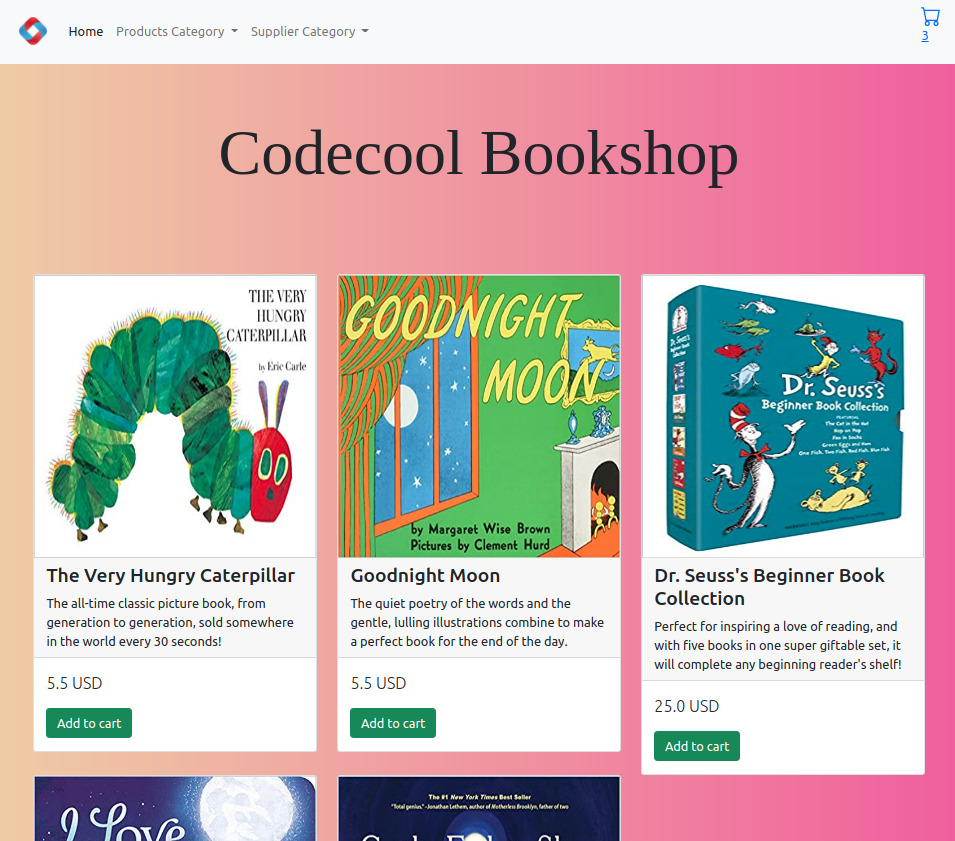
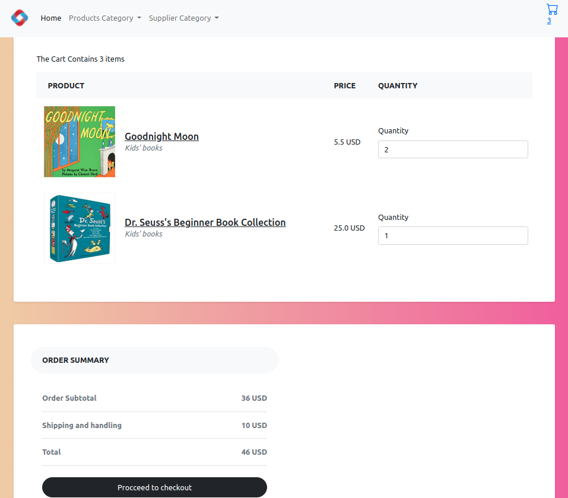

# Codecool Bookshop

## Story

CodeCool Shop is an online eCommerce web-application created with Java and an SQL database. We’re selling parenting and kids books.

Users can browse the books by type - for kids or for parenting - or by supplier - the publishing house; and can add them into a Shopping Cart.

## Technologies used

-   Java
-   JavaScript
-   Bootstrap
-   HTML & CSS
-   PostgreSQL

## The app itself

